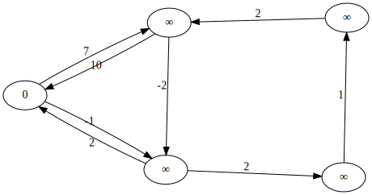
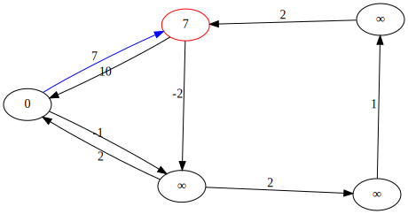
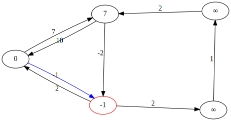
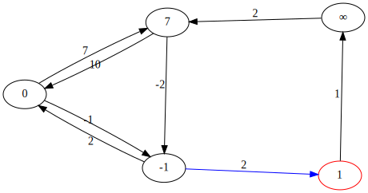
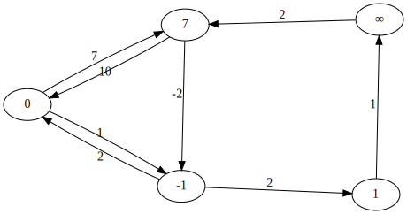
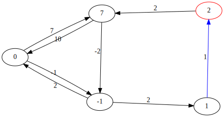
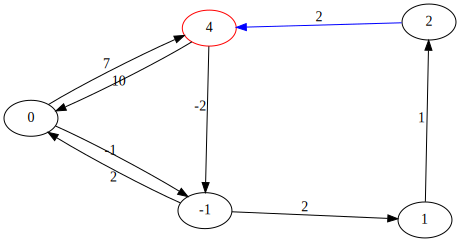

SSSP
====

Einleitung
----------

* Problem: Dijkstra kommt nicht mit negativen Kanten zurecht

<!-- Beispielgraph -->

* Lösung: rohe ~~Gewalt~~ Rechenleistung

* Wichtige Einschränkung: negative Kreise auf irgendeinem Pfad von `Q` zu `S` bedeuten
  Nichtexistenz eines kürzesten Pfades
* Idee 1: vollständige Tiefensuche.
	* selbst für Brute-Force-Verhältnisse zu langsam (exponentielle Laufzeit?) *TODO: ?*
* Idee 2:
	* kürzester Pfad enthält maximal $|V| - 1$ Kanten
	* Enthalte der kürzeste Pfad $i$ Kanten. Falls wir alle kürzesten Pfade mit bis zu $i - 1$ Knoten kennen:
		* Zu den kürzesten Pfaden mit bis zu $i$ Kanten fehlt höchstens eine Kante.
		* Probiere für alle Kanten, ob sie irgendwo einen kürzeren Pfad erzeugen
	* Für $i = 0$ ist die Distanz der Quelle zu sich selbst 0, und die zu allen anderen Knoten $\inf$

* Idee 2 ist offensichtlich vielversprechender, sie führt zum Algorithmus von Belllman und Ford.

Erklärung
---------

*mündliche Erklärung anhand von Graphiken*

* Runde 1

* Runde 2

* Runde 3 (keine Änderungen → fertig)

*Zeigen des Quellcodes (anderes Dokument im Repository)*

Weitere Eigenschaften
---------------------

* Negative Kreise lassen sich durch eine weitere Anwendung detektieren
* Negative Kreise die nicht auf dem Weg zum Ziel liegen, verfälschen das Ergebnis nicht
	* Die Detektion aller problemlosen Knoten ist mit $V - 1$ weiteren Anwendungen möglich

Beurteilung
-----------

* Assymptotische Komplexität $\in O(|V| \cdot |E|)$
* Profitiert nicht von kurzen Distanzen zwischen Quelle und Senke
* Relativ leicht zu implementieren

Fazit
-----

> Kann man schon so machen, meistens will man das aber nicht

