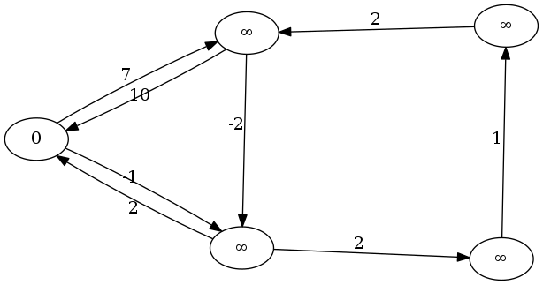
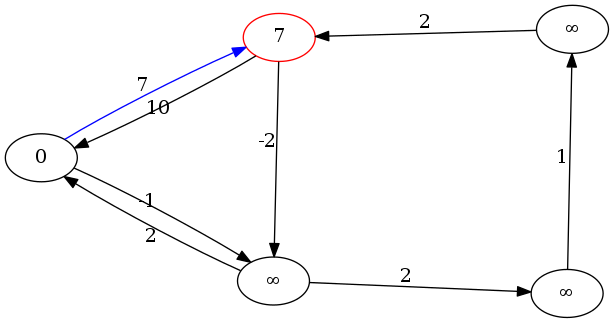
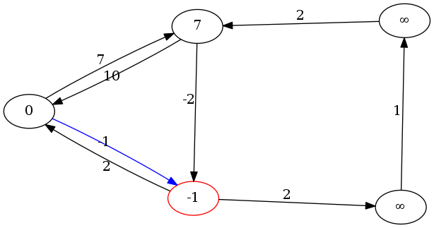
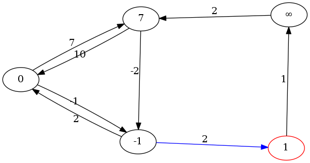
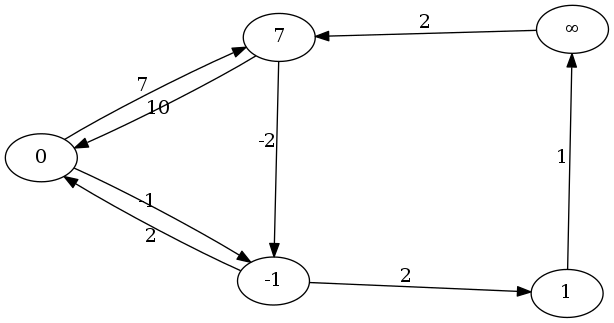
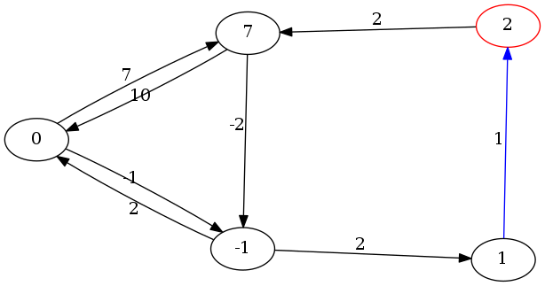
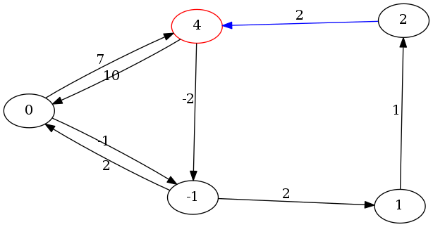
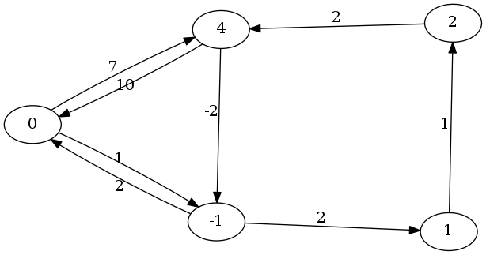

SSSP
====

Übersicht
---------

* Problem: Dijkstra kommt nicht mit negativen Kanten zurecht

<!-- Beispielgraph -->


Ansätze
-------

* Lösung: rohe ~~Gewalt~~ Rechenleistung

* Wichtige Einschränkung: negative Kreise auf irgendeinem Pfad von `Q` zu `S` bedeuten
  Nichtexistenz eines kürzesten Pfades
* Idee 1: vollständige Tiefensuche.
	* selbst für Brute-Force-Verhältnisse zu langsam (exponentielle Laufzeit?) *TODO: ?*
* Idee 2:
	* kürzester Pfad enthält maximal $|V| - 1$ Kanten
	* Enthalte der kürzeste Pfad $i$ Kanten. Falls wir alle kürzesten Pfade mit bis zu $i - 1$ Knoten kennen:
		* Zu den kürzesten Pfaden mit bis zu $i$ Kanten fehlt höchstens eine Kante.
		* Probiere für alle Kanten, ob sie irgendwo einen kürzeren Pfad erzeugen
	* Für $i = 0$ ist die Distanz der Quelle zu sich selbst 0, und die zu allen anderen Knoten $\inf$

* Idee 2 ist offensichtlich vielversprechender, sie führt zum Algorithmus von Belllman und Ford.

Initialisierung
---------------



Runde 1
-------



Runde 1
-------



Runde 1
-------



Runde 1 - Ende
--------------



Runde 2
-------



Runde 2
-------



Runde 2 - Ende
--------------



Runde 3 (keine Änderungen → fertig)
-----------------------------------


Code
----

###Definitionen

```cpp
using node = std::size_t;
using dist = double;

struct edge {
	node from;
	node to;
	dist weight;
};

const auto inf_dist
	= std::numeric_limits<dist>::infinity();
```


Code
----

```cpp
std::vector<dist> bellman_ford(std::size_t node_count,
		const std::vector<edge>& edges, node source) {
	std::vector<dist> min_dists(node_count, inf_dist);
	min_dists[source] = 0;
	for (std::size_t i = 0; i < node_count + 1; ++i) {
		bool changes = false;
		for(const auto& e: edges) {
			const auto old_dist = min_dists[e.to];
			const auto new_dist = min_dists[e.from]
			                      + e.weight;
			if (new_dist < old_dist) {
				min_dists[e.to] = new_dist;
				changes = true;
			}
		}
		// ...
```

...

Code
----

```cpp
		// ...
		if (!changes) { break; }
		if (i == node_count) {
			throw std::runtime_error{"negative cycle"};
		}
	}
	return min_dists;
}
```


Code
----

```cpp
int main() try {
	const auto edges = std::vector<edge>{
		{0, 1,  7}, {0, 4,  -1},
		{1, 0, 10}, {1, 3,  -4},
		{2, 4,  1},
		{3, 0,  0}, {3, 2, 2.5},
		{4, 1, 23}
	};
	const auto min_dists = bellman_ford(5, edges, 0);
	std::copy(min_dists.begin(), min_dists.end(),
		std::ostream_iterator<dist>{std::cout, "\n"});
} catch (std::runtime_error& e) {
	std::cerr << "Error: " << e.what() << '\n';
}
```

Weitere Eigenschaften
---------------------

* Negative Kreise lassen sich durch eine weitere Anwendung detektieren
* Negative Kreise die nicht auf dem Weg zum Ziel liegen, verfälschen das Ergebnis nicht
	* Die Detektion aller problemlosen Knoten ist mit $V - 1$ weiteren Anwendungen möglich

Beurteilung
-----------

* Assymptotische Komplexität $\in O(|V| \cdot |E|)$
* Profitiert nicht von kurzen Distanzen zwischen Quelle und Senke
* Relativ leicht zu implementieren

Fazit
-----

> Kann man schon so machen, meistens will man das aber nicht

